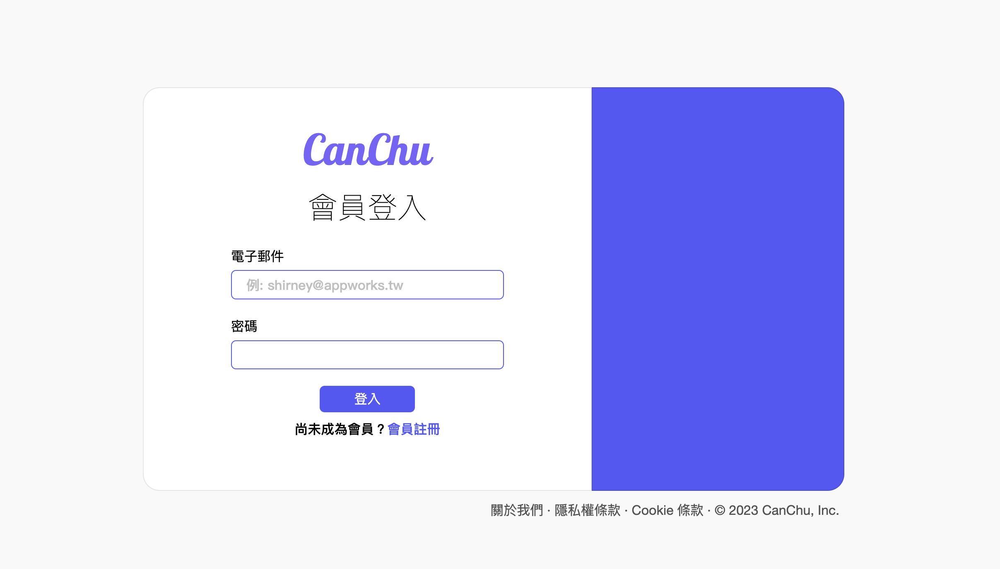
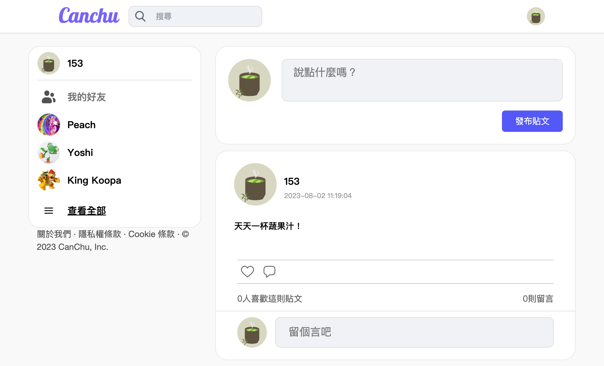
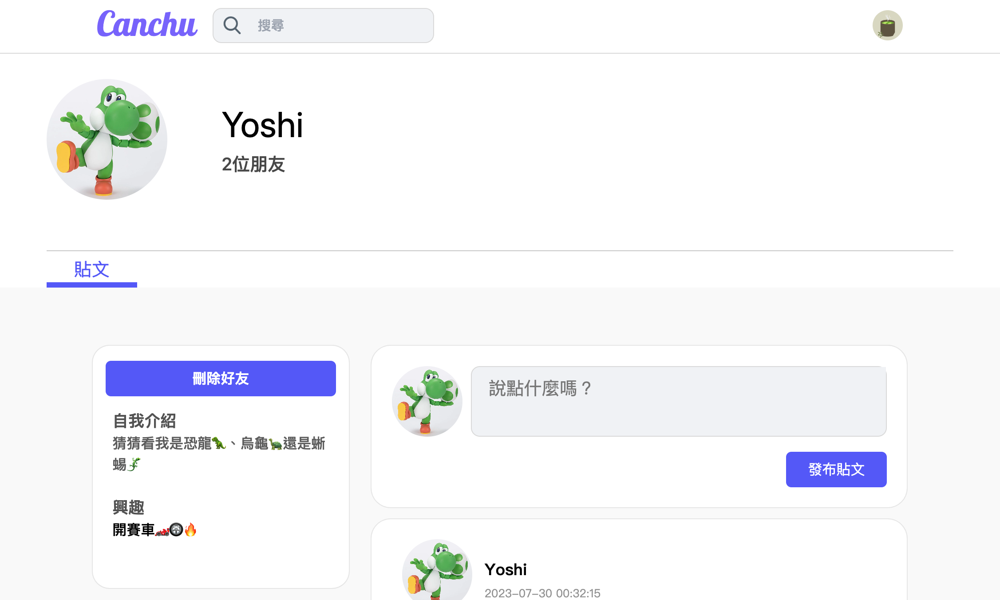

This is a social media website built in [Next.js](https://nextjs.org/).

## Getting Started

```bash
git clone https://github.com/brownrice-02/CanChu.git
cd CanChu/
yarn install
yarn run dev
```

Open [http://localhost:3000](http://localhost:3000) with your browser to see the result.

## Screenshots

Signup Page | Home Page | Profile Page
:-------------------------:|:-------------------------:|:----------------:
 |  | 